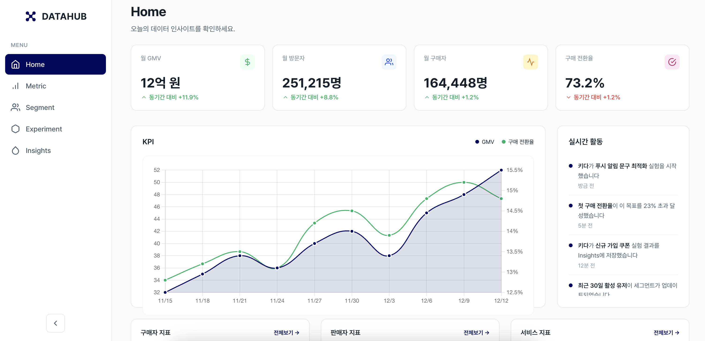

# DataHub

  

## DataHub를 만드는 이유

데이터 사이언티스트이자 분석가로 일하면서 반복해서 마주친 문제는 기술이 아니라 **공유**였습니다.

* 지표는 존재하지만, 어디에 정의되어 있는지 모른다
* 세그먼트는 매번 새로 만들고, 인사이트는 개인의 머릿속에만 남는다
* 실험은 했지만, 결과와 해석이 문서로 남지 않는다
* 결국 데이터는 **개개인의 손에서 해석이 반복되지만, 축적되지 않는 자원**이 된다.

DataHub는 이 문제를 해결하기 위해 시작한 토이 프로젝트입니다.

---

## DataHub의 지향점

DataHub는 다음 질문에 답할 수 있는 사이트를 만들어 보는 것을 목표로 하고 있습니다.

* 지금 가장 **중요한 지표는 무엇이며**, 그 지표는 어떻게 정의되고, 누가 책임지고 관리하는가?
* 우리의 핵심 **고객 세그먼트**는 누구이며, 각 세그먼트의 정의와 현재 상태는 어떠한가?
* 우리는 어떤 **가설을 세우고**, 어떤 **실험을 했으며**, 무엇을 배웠는가?
* 지금까지의 인사이트는 **어디까지 공유되고, 어떻게 재사용되는가?**

이를 구현하기 위 DataHub의 구성은 다음과 같습니다.

* **Metric**: 정의와 맥락이 함께 남는 지표
* **Segment**: 일회성이 아닌, 반복 사용 가능한 고객 단위
* **Experiment**: 성공/실패와 상관없이 학습이 축적되는 실험 기록
* **Insight**: 숫자 너머의 해석과 의사결정 맥락

또한 DataHub는 구성원들이 더 쉽게 참여할 수 있는 사용성을 중요하게 고려합니다.

* 문서 작성, 쿼리 작성의 진입 장벽을 낮추기 위해 AI 보조 기능을 활용
* 분석가가 아니어도 맥락을 남기고, 질문을 던질 수 있는 구조 지향
* AI는 자동화가 아니라, 공유와 참여를 돕는 수단으로 사용

---

## 기술 스택

대부분의 코드는 바이브 코딩(vibe coding)으로 작성되었습니다.

* Backend: FastAPI + SQLAlchemy
* Frontend: React + Vite
* Database: SQLite (초기 단계)

복잡한 인프라나 과도한 추상화보다는, **문제 정의와 구조 설계**에 더 많은 비중을 두고 있습니다.